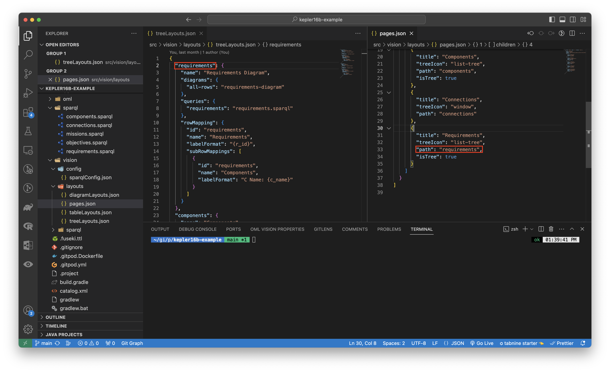
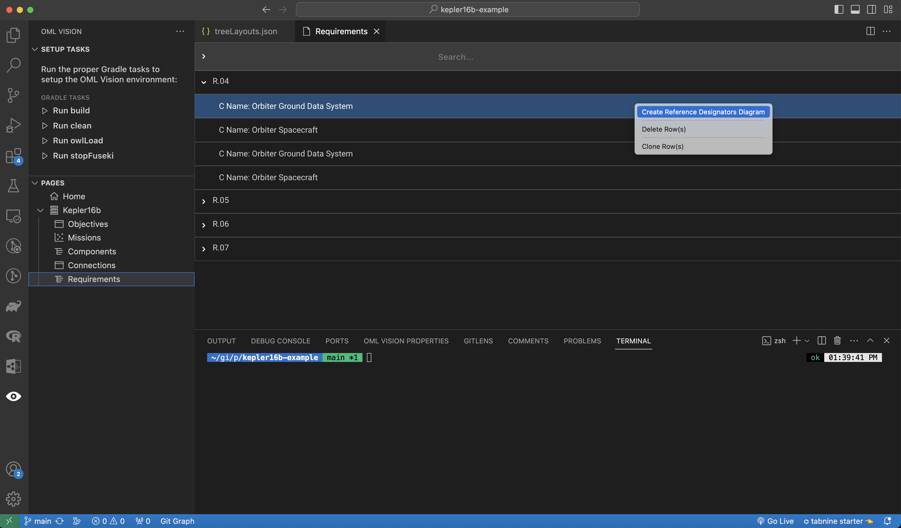

# Trees

:::info trees.json

Create a `src/vision/layouts/trees.json` file (case-sensitive)

:::

The `src/vision/layouts/trees.json` file is responsible for: 

- Defining what OML Vision Trees can render
  - Name of the Trees
  - Commands that can be executed from the Trees
  - Name of the columns for the Trees
  - Queries that the Trees's content needs
  - How to map Tree queries to columns

It is formatted as a JSON data structure.

<!-- TODO: Change to opencaesar repo -->
An example of what this looks like is seen below with the source code found [here](https://github.com/pogi7/kepler16b-example/blob/main/src/vision/layouts/treeLayouts.json)

```json
{
  "requirements": {
    "name": "Requirements Diagram",
    "diagrams": {
      "all-rows": "requirements-diagram"
    },
    "queries": {
      "requirements": "requirements.sparql"
    },
    "rowMapping": {
      "id": "requirements",
      "name": "Requirements",
      "labelFormat": "{r_id}",
      "subRowMappings": [
        {
          "id": "requirements",
          "name": "Components",
          "labelFormat": "C Name: {c_name}"
        }
      ]
    }
  },
  "components": {
    "name": "Components",
    "diagrams": {
      "all-rows": "components-diagram"
    },
    "queries": {
      "components": "components.sparql"
    },
    "rowMapping": {
      "id": "components",
      "name": "Components",
      "labelFormat": "{c1_id} {c1_name}",
      "subRowMappings": [
        {
          "id": "components",
          "name": "Masses",
          "labelFormat": "{c1_mass}"
        }
      ]
    }
  }
}
```

## Defining Tree

A tree must be properly defined in order to be rendered by OML Vision

### path
:::danger REQUIRED

```typescript
path: string
```

:::


This string defines the path of the Tree.

:::tip USER INTERFACE

The name of the `path` is the same path that was defined in the `pages.json`.



:::

### name
:::note OPTIONAL

```typescript
name: string
```

:::


This string gives a name to the Tree in the `treeLayouts.json` file.  

<!-- TODO: Change from diagrams to commands -->
### diagrams
:::note OPTIONAL

```typescript
diagrams: {
    all-rows: string
  }
```

:::


The diagrams object defines the commands that the Tree is able to execute. 

:::tip USER INTERFACE

The `diagrams` correspond to the commands that appear when a user right clicks a row in the Tree.



:::

#### all-rows
:::danger REQUIRED

```typescript
all-rows: string
```

:::


This string defines that all rows have the commands defined available for them to execute.  The name of the string is arbitrary, but a good name for `all-rows` is "all-rows".

### queries
:::danger REQUIRED

```typescript
queries: {}
```

:::

This object contains the queries that will query the RDF Triplestore for the content that will populate in the Tree. 

**Look at the sparql docs for more info found [here](/docs/api-documentation/sparql)**

:::tip FUSEKI

You can test queries by going to localhost:3030 which is created once data is loaded into the Fuseki DB.  You can watch more info about testing queries with Fuseki by going [here](https://www.youtube.com/watch?v=w_pJ3XiBWeM&t=621s)

The AI & DS Channel (2021, February 18). SPARQL Query [Video]. YouTube. https://www.youtube.com/watch?v=w_pJ3XiBWeM&t=621s

:::

### rowMapping
:::danger REQUIRED

```typescript
rowMapping: {}
```

:::

This object defines how the `queries` map to the `columnNames`

#### id
:::danger REQUIRED

```typescript
id: string
```

:::

This string the `id` for the `rowMapping`.

:::tip USER INTERFACE

The `id` correspond to one of the `columnNames`.


:::

#### name
:::note OPTIONAL

```typescript
name: string
```

:::

This string gives a name to the `rowMapping`.  

#### labelFormat
:::danger REQUIRED

```typescript
labelFormat: string
```

:::

This string contains the label of the row for the `rowMapping`.

:::tip USER INTERFACE

The `labelFormat` is rendered in the rows of the Tree shown in the red boxes.

**STRING INTERPOLATION**

OML Vision supports string interpolation with the queries that were formatted.  The format is `"{string}"`  

An example is found [here](https://github.com/pogi7/kepler16b-example/blob/main/src/vision/layouts/treeLayouts.json#L18)


:::

#### subRowMappings
:::note OPTIONAL

```typescript
subRowMappings: {
    id: string
    name: string
    labelFormat: string
  }[]
```

:::

This `subRowMappings` array of obejcts defines the `id`, `name`, and `labelFormat` of the Tree.

**The `id`, `name`, and `labelFormat` have the same data structure as `rowMapping`**